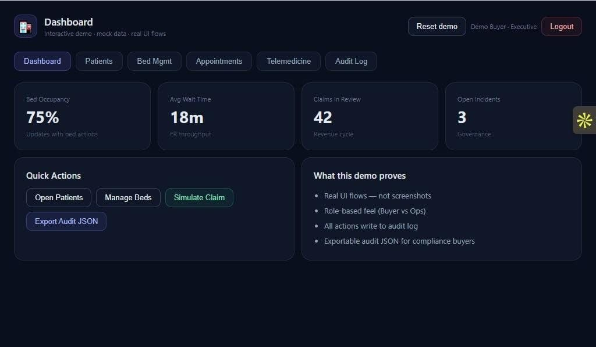
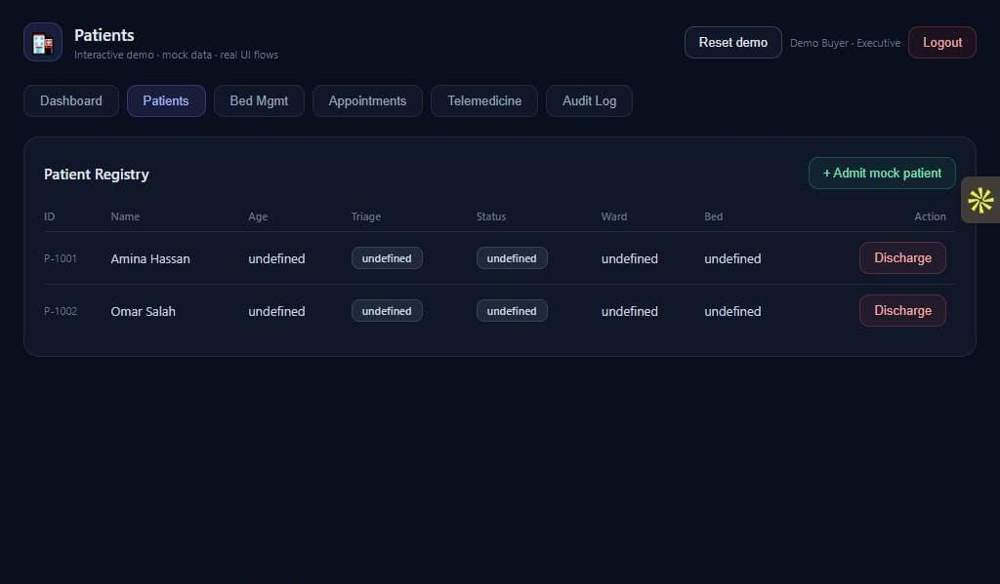
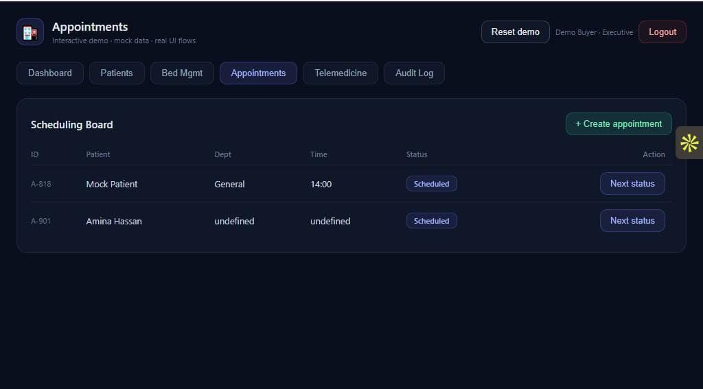
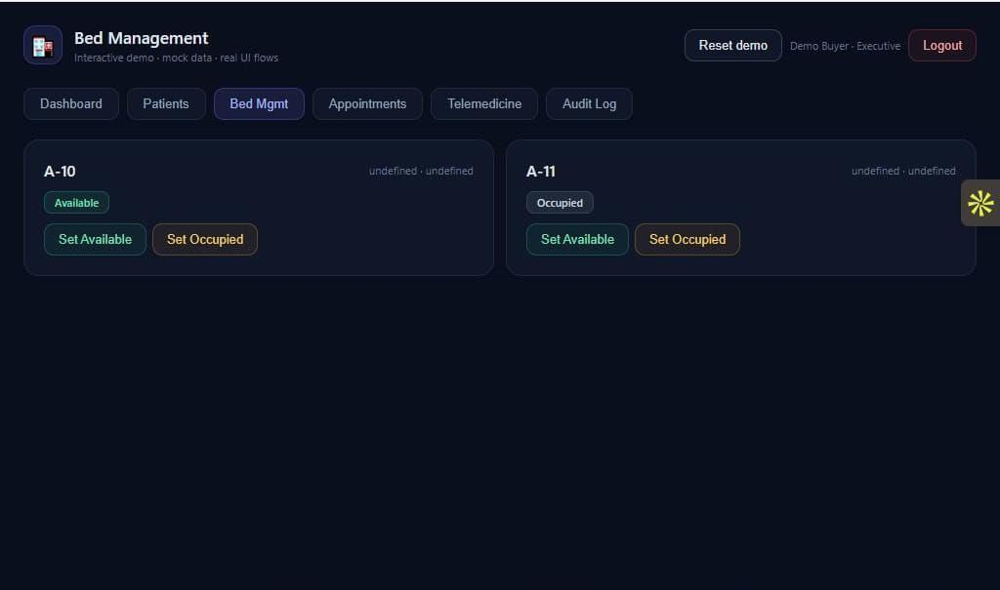
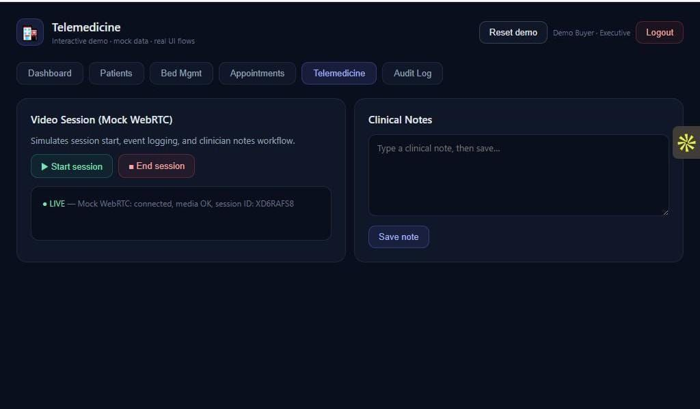

<div align="center">

# 🏥 UCH Buyer Kit
### Unity Care Hospital — Institutional Procurement Package
**Private · Confidential · NDA Required**

Unity Care Hospital (UCH) is a deployable digital hospital platform
designed to support modern healthcare operations including patient management,
telemedicine consultations, hospital bed allocation, and compliance logging.

The platform enables healthcare providers to deploy a full digital hospital
infrastructure in less than **30 days**.

[](./LICENSE)
[]()
[](mailto:info@uch.teosegypt.com)

**This repository is private and confidential.**  
Access is granted under NDA to verified institutional buyers only.

📧 info@uch.teosegypt.com · 📞 +20 100 616 7293  
🌐 [UCH Institutional Overview](https://uch.teosegypt.com) 
🎯 [Interactive Institutional Demo Environment](https://unity-care-hospital.vercel.app)
</div>

---

# Platform Capabilities

Unity Care Hospital provides a unified operational platform for modern healthcare infrastructure.

Core capabilities include:

• Executive operations dashboard with real-time KPIs  
• Patient admission, triage, and discharge workflows  
• Multi-department appointment scheduling  
• Hospital bed allocation and occupancy monitoring  
• Telemedicine consultation environment  
• Immutable audit logging for operational transparency  

The platform supports both **single hospital deployments** and **multi-hospital healthcare networks**.

---

# What's In This Kit

| Document | Purpose |
|---|---|
| EXECUTIVE_SUMMARY.md | Board-level overview |
| ARCHITECTURE_OVERVIEW.md | Technical architecture brief |
| SECURITY_OVERVIEW.md | Security and compliance posture |
| PROCUREMENT_MODEL.md | Procurement tiers and pricing |
| FINANCIAL_MODEL.md | 3-year financial projections |
| PILOT_STRUCTURE.md | Pilot deployment structure |
| NDA_TEMPLATE.md | NDA for institutional review |
| INSTITUTIONAL_PROPOSAL.md | Board-ready proposal template |

---

# Platform Screenshots

**Interactive Institutional Demo**

🎯 [Interactive Institutional Demo Environment](https://unity-care-hospital.vercel.app)---


Demo access is granted to verified institutional reviewers.

### Dashboard


### Patient Registry


### Appointment Scheduling


### Bed Management


### Telemedicine Consultation Environment


# Market Opportunity

Global digital health infrastructure spending is projected to exceed **$500B by 2030**.

Healthcare providers increasingly require:

• Telemedicine infrastructure  
• Digital patient management systems  
• Compliance-ready audit logging  
• Remote consultation capabilities  

Unity Care Hospital provides a deployable platform for healthcare operators seeking to modernize hospital infrastructure **without building custom healthcare software stacks**.

---

# Deployment Tiers

| Tier | Investment | Description |
|---|---|---|
| Institutional Pilot | $45,000 | 90-day validation, single facility |
| Institutional License | $89,000+ | Full platform, white-label |
| Full IP Transfer | $275,000+ | Complete ownership of platform |
| Sovereign National Stack | $425,000+ | Air-gapped national infrastructure |

Pilot investment is **fully credited toward license upgrade**.

---

# Deployment Model

Unity Care Hospital can be deployed in several configurations:

Cloud Deployment  
Hosted infrastructure for rapid startup.

Private Cloud  
Institution-controlled hosting environment.

On-Premise Deployment  
Air-gapped infrastructure for national healthcare systems.

Hybrid Infrastructure  
Integration with existing hospital IT environments.

---

# Integration Readiness

UCH is designed to integrate with existing healthcare infrastructure including:

• Electronic Health Record (EHR) systems  
• Hospital billing platforms  
• Scheduling systems  
• Telemedicine platforms  
• National health data networks  

The system uses an **API-first architecture** enabling integration without replacing existing hospital systems.

---

# Quick Links

| | |
|---|---|
| Live Marketing Site | https://uch.teosegypt.com |
| Interactive Demo | https://unity-care-hospital.vercel.app |
| Public Technical Repo | https://github.com/Elmahrosa/Unity-Care-Hospital |
| Contact | info@uch.teosegypt.com |
| Phone | +20 100 616 7293 |

---

# Next Steps

```

1. Review documentation in /docs
2. Sign NDA (docs/NDA_TEMPLATE.md)
3. Schedule institutional briefing call
4. Receive scoped institutional proposal
5. Launch pilot deployment

```

---

<div align="center">

Confidential — Elmahrosa International · Egypt  
Unauthorized distribution is prohibited.

</div>
```
